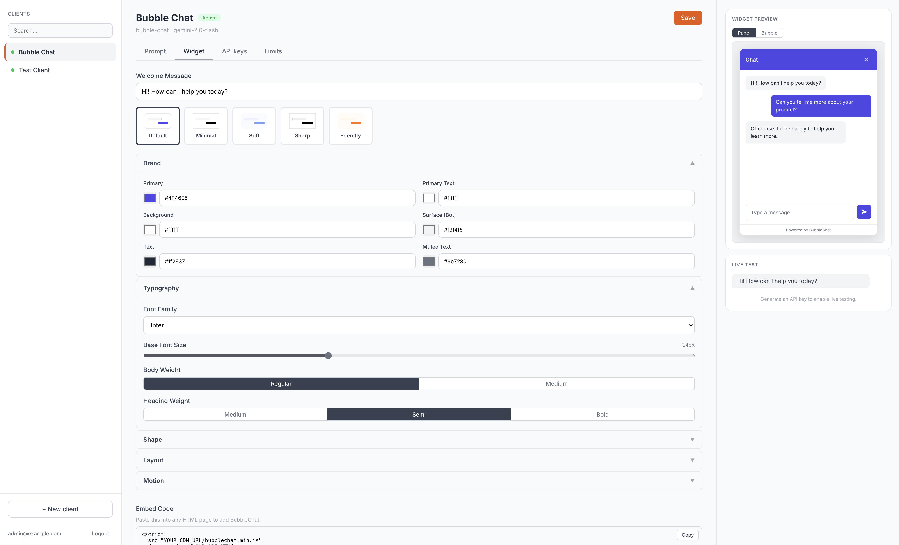

# BubbleChat

**A full-stack, embeddable AI chat widget with a real-time admin dashboard.**

Deploy an AI-powered chat assistant on any website with a single script tag. Manage everything — prompts, styling, API keys — from a live-preview dashboard.



---

## Highlights

- **One-line embed** — Add AI chat to any site with a single `<script>` tag
- **Streaming responses** — Token-by-token delivery via Server-Sent Events for instant perceived speed
- **Full white-labeling** — Colors, fonts, shapes, layout, and animations are all customizable from the dashboard
- **Multi-tenant** — Each client gets isolated prompts, API keys, allowed origins, and usage limits
- **Live preview** — See styling changes reflected in real time before deploying
- **Zero dependencies** — The widget is pure vanilla TypeScript compiled to a single minified JS file
- **Shadow DOM isolation** — Widget styles never conflict with the host page

---

## Tech Stack

| Layer | Technologies |
|-------|-------------|
| **Widget** | TypeScript, Web Components, Shadow DOM, SSE, esbuild |
| **Backend** | Python, FastAPI, SQLAlchemy 2.0 (async), Alembic, Google Gemini |
| **Dashboard** | React 19, TypeScript, React Router 7, Vite |
| **Infrastructure** | Docker Compose, PostgreSQL, uvicorn |

---

## Architecture

```
┌─────────────────┐       ┌──────────────────┐       ┌──────────────────┐
│   Embeddable    │       │   FastAPI         │       │   React Admin    │
│   Chat Widget   │◄─SSE─►│   Backend         │◄─────►│   Dashboard      │
│   (vanilla TS)  │       │   + Gemini AI     │       │   (live preview) │
└─────────────────┘       └────────┬─────────┘       └──────────────────┘
                                   │
                          ┌────────▼─────────┐
                          │   PostgreSQL      │
                          │   (async)         │
                          └──────────────────┘
```

**Widget** — A custom HTML element using Shadow DOM for complete style encapsulation. Reads configuration from `data-*` attributes on the script tag and streams AI responses over SSE. No framework, no dependencies.

**Backend** — Async FastAPI server handling chat streaming, client management, and API key auth. System prompts are injected server-side to prevent prompt manipulation. Rate limiting and conversation history (capped at 50 messages) are built in.

**Dashboard** — Three-panel React app for managing clients. Edit system prompts, customize every visual aspect of the widget (brand colors, typography, border radius, animations), generate API keys, and test with a live preview connected to the real API.

---

## Getting Started

### Docker (recommended)

```bash
cp .env.example .env    # configure your GEMINI_API_KEY
docker compose up
```

### Manual Setup

```bash
# Backend
cd backend
python -m venv .venv && source .venv/bin/activate
pip install -e ".[dev]"
uvicorn app.main:app --reload

# Dashboard
cd dashboard
npm install && npm run dev

# Widget
cd widget
npm install && npm run build
```

---

## Embed in 30 Seconds

```html
<script
  src="YOUR_CDN_URL/bubblechat.min.js"
  data-api-key="your-api-key"
  data-api-url="https://your-api.com"
  data-position="bottom-right">
</script>
```

That's it. The widget handles the rest — connection, streaming, session management, and styling.

---

## Project Structure

```
Chat-Widget/
├── widget/                 # Embeddable chat widget (vanilla TS)
│   ├── src/
│   │   ├── widget.ts       # Web Component (Shadow DOM)
│   │   ├── api.ts          # HTTP client + SSE stream parser
│   │   └── styles.ts       # CSS custom properties theming
│   └── dist/               # Bundled output
│
├── backend/                # FastAPI API server
│   ├── app/
│   │   ├── api/            # Route handlers (chat, clients, auth)
│   │   ├── models/         # SQLAlchemy ORM (client, conversation, api_key)
│   │   ├── services/       # Gemini integration, auth, rate limiting
│   │   └── schemas/        # Pydantic request/response models
│   └── alembic/            # Database migrations
│
├── dashboard/              # React admin dashboard
│   └── src/
│       ├── components/     # Three-panel layout + styling editors
│       └── pages/          # Login, dashboard views
│
├── infra/                  # Dockerfiles
└── docker-compose.yml
```

---

## License

MIT
